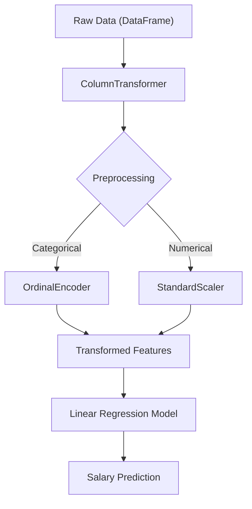

# 💼 Salary Prediction System (Industry-Grade ML Pipeline)


## 📌 Project Overview (https://salary-prediction0.streamlit.app/)

This project implements a **production-ready salary prediction system** using **scikit-learn Pipelines** and **ColumnTransformer**. The core philosophy is to lock the entire preprocessing and model logic together, ensuring **consistent, safe, and deployable predictions**.

The system follows **industry best practices** to prevent data leakage and ensure that the rules defined during training are rigorously applied during inference.

### 🚀 Live Demo
Run the Streamlit app locally to interact with the model:
```bash
streamlit run app.py
```

---

## 🎯 Key Objectives

*   **Predict Salary**: Estimate employee salary based on structured HR data.
*   **Prevent Data Leakage**: Encapsulate all preprocessing within the pipeline.
*   **Consistency**: Ensure train–test–production environments use identical transformations.
*   **Deployment Ready**: Save the entire logic as a single, portable pickle file.

---

## 🧠 Core Design Principle

> **"The pipeline defines the rules. Data must follow those rules — the rules never change."**

---

## 📊 Dataset Features

The model utilizes a mix of numerical and categorical features:

### 🔢 Numerical Features
*   `YearsExperience`
*   `Age`
*   `PerformanceRating` (1-5)
*   `ProjectsCompleted`
*   `Certifications` (Count)

### 🔠 Ordinal Categorical Features
These features are encoded with explicit ordinal relationships:
*   **Education**: Bachelor < Master < PhD
*   **JobType**: HR < Sales < Marketing < Engineering < DataScience < Management
*   **Location**: Rural < Suburban < Urban
*   **CompanySize**: Small < Medium < Large
*   **Promoted**: No < Yes

### 🎯 Target Variable
*   `Salary`

---

## 🏗️ Architecture (Industry Standard)

The project uses a robust pipeline architecture:



*   **One ColumnTransformer**: Handles all feature engineering.
*   **One Pipeline**: Chains preprocessing and modeling.
*   **One Pickle File**: Contains the entire trained artifact.

---

## ⚙️ Technologies Used

*   **Python**: Core programming language.
*   **pandas**: Data manipulation and analysis.
*   **scikit-learn**: Machine learning library for pipelines and modeling.
*   **Streamlit**: Web framework for the interactive frontend.
*   **pickle**: Object serialization for model persistence.

---

## 🧪 Model Workflow

1.  **Train–Test Split**: Preprocessing is fit **only** on training data. Test data is never used to learn scaling or encoding parameters.
2.  **Preprocessing (Inside Pipeline)**:
    *   `OrdinalEncoder` learns category mappings.
    *   `StandardScaler` learns mean and standard deviation.
3.  **Model Training**: Linear Regression learns coefficients on the transformed data.
4.  **Inference**: Raw input is passed through the **same frozen pipeline** to generate predictions.

---

## 🚀 How to Run

### 1. Install Dependencies
```bash
pip install pandas scikit-learn streamlit
```

### 2. Train the Model (Optional)
If you want to retrain the model from scratch:
```python
# Run the notebook or script containing the training logic
# This will generate 'MLR_USING_PIPE.pkl'
```

### 3. Run the App
Launch the Streamlit interface:
```bash
streamlit run app.py
```

---

## 🔮 Production Usage (Python API)

To use the model in a production script:

```python
import pandas as pd
import pickle

# Load the pipeline
model = pickle.load(open("MLR_USING_PIPE.pkl", "rb"))

# Define a sample input (raw data)
sample = pd.DataFrame([{
    'YearsExperience': 5,
    'Age': 30,
    'Education': 'Bachelor',
    'JobType': 'Engineering',
    'Location': 'Urban',
    'CompanySize': 'Medium',
    'PerformanceRating': 3,
    'ProjectsCompleted': 10,
    'Certifications': 2,
    'Promoted': 'No'
}])

# Predict
prediction = model.predict(sample)
print(f"Predicted Salary: ${prediction[0]:,.2f}")
```

---

## 🔐 Why This Is Industry-Grade

| Feature | Status | Description |
| :--- | :---: | :--- |
| **Data Leakage Prevention** | ✅ | Preprocessing is strictly isolated to training data. |
| **Single Contract** | ✅ | One pipeline handles raw-to-prediction logic. |
| **Deployment Safety** | ✅ | No manual preprocessing required in production code. |
| **Reproducibility** | ✅ | Deterministic transformations ensure consistent results. |
| **Pickle-Ready** | ✅ | The entire object is serializable. |

---

## 👤 Author

Built with **industry-level ML practices** for learning and deployment readiness.
