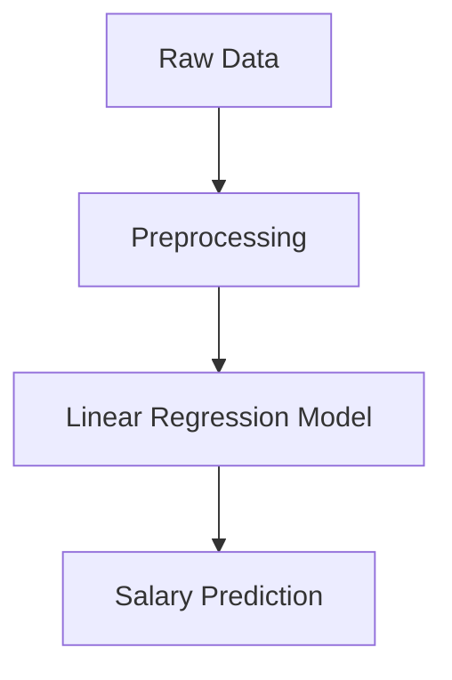

# Salary Prediction System 💼

Hi there! 👋 This is my Machine Learning project where I built a system to predict employee salaries based on their details.

I used **Python** and **Machine Learning** (Linear Regression) to analyse data and make predictions. I also created a cool web app using **Streamlit** so anyone can easily use it!

## 🎯 What does it do?

You enter details like:
*   **Years of Experience**
*   **Education Level** (Bachelor, Master, PhD)
*   **Job Role** (Engineering, Sales, HR, etc.)
*   **Company Size**
*   ...and more!

And the model predicts the **Estimated Monthly Salary** in Rupees (₹).

## 🛠️ How I built it

1.  **Data**: I used a dataset with employee information.
2.  **Preprocessing**: I cleaned the data and converted text (like "Urban", "Rural") into numbers so the computer can understand it. I used something called a `Pipeline` to keep everything organized.
3.  **Model**: I used **Linear Regression** to find the relationship between experience/skills and salary.
4.  **Web App**: I built the frontend using **Streamlit**.

Here is a simple flow chart of my project:



## 🚀 How to Run this Project

If you want to try this on your own computer, follow these steps:

1.  **Install the required libraries**:
    ```bash
    pip install pandas scikit-learn streamlit
    ```

2.  **Run the App**:
    ```bash
    streamlit run app.py
    ```

That's it! The app will open in your browser.

## 📂 Project Structure

*   `app.py`: The main code for the website.
*   `MLR_USING_PIPE.pkl`: The saved machine learning model.
*   `MLR_USING_PIPE.ipynb`: The notebook where I trained the model.
*   `Salary_dataset.csv`: The data I used.

---
*Created by Aman Sharma*
